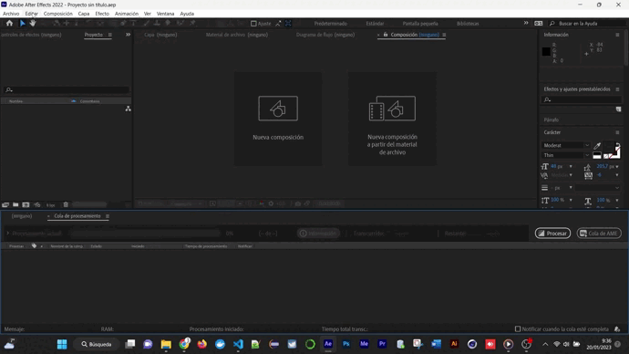

# unir_tfg_gilvalencia
<h3> Repositorio de código fuente del Diseño de la Propuesta del Trabajo Final del Grado de Ingeniería Informática </h3>
<h3> Universidad Internacional de La Rioja </h3>
__________________________________________________________________________________________________________________________________________________
<h5> <b>Título del Trabajo</b>: Data-Driven Video. Automatización y Control de Proyectos Audiovisuales en Marketing y Publicidad </h5>
<h5> <u>Alumno</u>: José Antonio Gil Valencia</h5>
<h5> <u>Directora</u>: Belén Bermejo González</h5>
<h5> <u>Curso</u>: 2022-2023 </h5>
__________________________________________________________________________________________________________________________________________________
<h4>FICHEROS NECESARIOS</h4>

<h5> Para poder ejecutar el código fuente de la arquitectura propuesta, existen dos ficheros necesarios para ejecutarlo en la máquina destino:</h5>
<ul><h5>-->"unir_tfg_gilvalencia_01": recoge todo el código de la aplicación (Front-End, Back-End y docker-compose para ejecutar los contenedores necesarios y crear el servidor "php-apache" (FICHERO ACCESIBLE EN ESTE MISMO REPOSITORIO)</h5></ul>
<ul><h5>-->"unir_tfg_gilvalencia_AE": incluye proyecto de Adobe After Effects y los materiales de la pieza audiovisual (<a href="https://drive.google.com/file/d/1AQxBwFAhkOlMAtq45poeyL-uN3n3Vma8/view?usp=share_link">FICHERO DESCARGABLE DESDE ESTE ENLACE</a>)</h5></ul>
__________________________________________________________________________________________________________________________________________________
<h4>APLICACIONES NECESARIAS</h4>

<h5> Ejecutar los dos ficheros que forman la arquitectura requiere tener instalados:
<ul><h5>--><a href="https://www.docker.com/products/docker-desktop/">Docker Desktop</a></h5></ul>
<ul><h5>--><a href="https://www.adobe.com/es/products/aftereffects.html">Adobe After Effects</a></h5></ul>
<ul><h5>--><a href="https://www.autohotkey.com/">AutoHotkey</a></h5></ul>
__________________________________________________________________________________________________________________________________________________
<h4>PROCEDIMIENTO</h4>

<ul>
  <h5>1.-UBICACIÓN DE LOS FICHEROS</h5>
    <li>
      <h5>Una vez descargados los dos ficheros, almacenar ambos en la misma ruta (Recomendación: raíz del sistema en Windows(C:)</h5>
    </li>
</ul>
<ul>
  <h5>2.-CORRECCIÓN DE RUTAS EN FICHEROS PARA SU LECTURA</h5>
  <ul>
    <h5>ARCHIVO "src/exts_scripts/script_powerMarkt.js":</h5>
    <li>
      LÍNEA 20: introducir el path donde se encuentre el proyecto de Adobe After Effects en la máquina (FICHERO "unir_tfg_gilvalencia_AE/AE")
    </li>
    <li>
      LÍNEA 200: ingresar el path donde se encuentra el material "products" en la máquina (FICHERO "unir_tfg_gilvalencia_AE/footage/products")
    </li>
    <li>
      LÍNEAS 1489-1492-1495: presets de renderizado del módulo de salida de After Effects (VER EN "AJUSTES DE PROYECTO ADOBE AFTER EFFECTS)
    </li>
    <li>
      LÍNEA 1529: ingresar el path donde se almacenen los archivos JSON (FICHERO "unir_tfg_gilvalencia_01\\src\\json\\template_powermarkt.json")
    </li>
  </ul>
</ul>
__________________________________________________________________________________________________________________________________________________
<h4>AJUSTES DE PROYECTO ADOBE AFTER EFFECTS</h4>

<ul>
  <h5>1.-CARGAR EN PROGRAMA PRESETS DE RENDERIZADO</h5>
    <li>
      <h5>Es necesario instalar los presets de renderizado, ya que a ellos se hace referencia en el formulario web y en el archivo JSON generado. Si no estuviesen instalados, la lectura de los mismos no se realiza y se paraliza la ejecución de la pieza</h5>
    </li>
    <li>
      <h5>Una vez instalado el software Adobe After Effects, lo ejecutamos. Una vez abierto, cargamos el archivo ".ars" ubicado en la ruta  "unir_tfg_gilvalencia_AE/renderQuality_presets/renderQuality_presets.ars"</h5>
    </li>
    <li>
      <h5>Dentro de Adobe AE, seguimos la ruta "Edición/Plantillas/Ajustes de Procesamiento/Cargar..."</h5>
    </li>
    <li>
      <h5>Cargamos el archivo "renderQuality_presets.ars", con todos los presets de renderizado necesarios para la ejecución de la aplicación</h5>
      ![]gifs_explicativos_proyecto/ingreso de plantillas presets render.gif
      
      gifs_explicativos_proyecto/ingreso de plantillas presets render.gif
    </li>
</ul>
<ul>
  <h5>2.-COMPROBAR LOS AJUSTES EN VENTANA DE PROCESAMIENTO</h5>
    <li>
      <h5></h5>
    </li>
    <li>
      <h5></h5>
    </li>
    <li>
      <h5></h5>
    </li>
    <li>
      <h5></h5>
    </li>
</ul>

